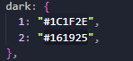
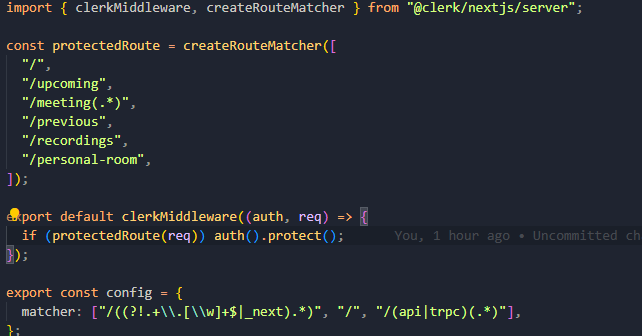
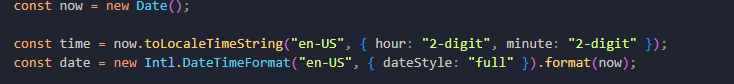
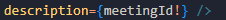
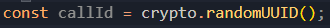

# Credo Conference

ctrl+b => hide/show sidebar in VS Code

## Tools and Technologies
  1. Next.js
    - file/app based routing
    - routh groups, example: (auth) => useful to group logic or structure
    - dynamic routes => [id] => when we dont know the exact segment names ahead of time and want to create routes from dynamic data, we can use this Dynamic Segments that are filled in at request time or prerendered at build time
    - catch all segments => [...segmentName] => will match with /shop/clothes or even /shop/clothes/t-shirts and so on
    - optional catch all segments => [[...segmentName]] => similar to the previous, but it will match also with /shop. It is really cool, when page is not required for the static segments, just for the dynamic
    - by default pages and components are renderd on the server
    - client componoents
      -these components are rendered in the browser
      -benefits: interactivity(hooks, event listeners) with the user
      -browser APIs: localStorage or geolocation
    -server components  
      -these components are renderd in the server and then sent it to the client
  2. Tailwind CSS
    - at tailwind.config.ts we can add custom color like this:  => we can use it like bg-dark-2
    - max-sm:hidden => from xxs to sm is hidden, so under sm is hidden
    - sm:hidden => from sm to xxl is hidden, so above sm is hidden
  3. Shadcn UI
    - sheet => animated popup => perfect for mobile menu, or popups from top-right-left or from bottom
  4. Clerk Auth
    - comprehensive user management platform
    - it is free until 10 000  monthly active users
    - magic links, social sign-in, multifactor auth
    - https://clerk.com/docs/quickstarts/nextjs
    - in the middleware.ts we can define public and private routes for our application
    - we can add auth protect to the protected pages
    
    -in .env.local file we can define the sign in and sign up URLs
  5. Project
    - we can format dates like this: 
    - 
    - in .env.local, if one of the constant includes PUBLIC key word, that means that we can use it on the client, but if it is not, then we know that we only access it on the server side due to protection
    - "use server" keyword, means that the code there is only running on the server
    - .flatMap() => [["rec1", "rec2"], ["rec3"]] => ["rec1", "rec2", "rec3"]
    -  => really useful, for example const *meetingId = user?.id*, we know that it has to be a string, so *meetingId!*
  6. Stream
    - with this tool we can build in app chat, video & audio and feeds in days
    - https://getstream.io/video/
    - https://getstream.io/video/docs/
    - Create an instance of StreamVideoClient that will establish WebSocket connection by connecting a user.
    - for server use cases, need to install yarn add @stream-io/node-sdk
    - first step: we have to create the token on the server side, in stream.actions.ts file we can do that, with server actions (next.js spec)
    - second step: create StreamVideoClient on the client side with the currently logged in clerk user (StreamClientProvider.tsx)
    - 

  